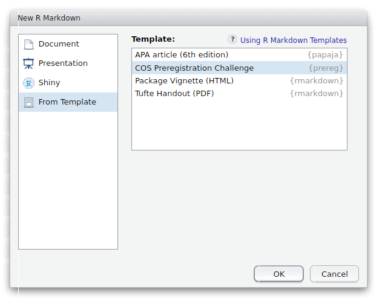
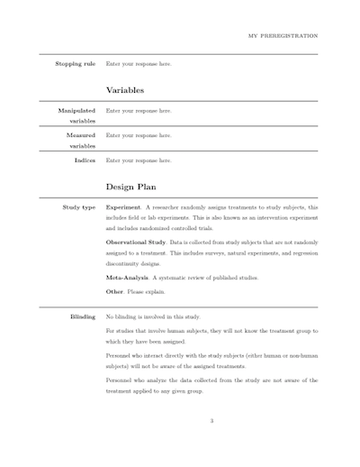
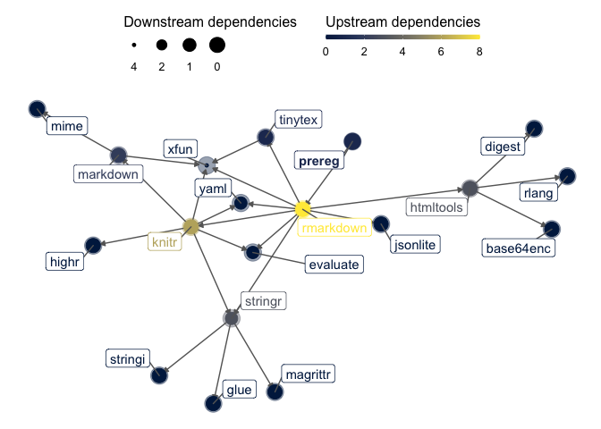

prereg: R Markdown Templates for Preregistrations of Scientific Studies
================

[](https://cran.r-project.org/package=prereg) [](https://cran.r-project.org/package=prereg) [](http://www.repostatus.org/#active) [](https://travis-ci.org/crsh/prereg)

`prereg` provides [R Markdown](http://rmarkdown.rstudio.com/) templates that facilitates authoring preregistrations of scientific studies in PDF format. The templates are based on the [Center for Open Science Preregistration Challenge](https://cos.io/prereg/) and the [AsPredicted.org](http://aspredicted.org) questions. They are, thus, particularly suited to draft preregistration documents for studies these programs but can also be used for internal preregistrations.

If you experience any problems or have suggestions for improvements, please [open an issue](https://github.com/crsh/prereg/issues).

Setup
-----

### Requirements

To use R Markdown and `prereg` you need the following software on your computer:

-   [R](http://www.r-project.org/) (2.11.1 or later)
-   [RStudio](http://www.rstudio.com/) (0.99.441 or later) is optional; if you don't use RStudio, you need to install [pandoc](http://johnmacfarlane.net/pandoc/) using the [instructions for your operating system](https://github.com/rstudio/rmarkdown/blob/master/PANDOC.md)
-   A [TeX](http://de.wikipedia.org/wiki/TeX) distribution (2013 or later; e.g., [MikTeX](http://miktex.org/) for Windows, [MacTeX](https://tug.org/mactex/) for Mac, obviously, or [TeX Live](http://www.tug.org/texlive/) for Linux)
-   If you are running **Windows**, use MikTex if possible. Currently, pandoc and the Windows version of Tex Live [don't seem to like each other](https://github.com/rstudio/rmarkdown/issues/6). Make sure you install the *complete*---not the basic---version.

### Install prereg

You can install the stable version of `prereg` from CRAN

``` s
install.packages("prereg")
```

or the development version from this GitHub repository (you may have to install the `devtools` package first).

``` s
install.packages("devtools")
devtools::install_github("crsh/prereg")
```

### Create a preregistration document

Once you have installed the `prereg` you can select the templates when creating a new R Markdown file through the RStudio menus.



#### Example

`prereg` produces a clean form-like document.

 

The template file contains comments that provide further details on how to fill in the form but are invisible in the final PDF document.


#### Using prereg without RStudio

If you want to use `prereg` without RStudio you can use the `rmarkdown::render` function to create preregistration documents:

``` s
# Create new COS preregistration challenge R Markdown file
rmarkdown::draft(
  "my_preregistration.Rmd"
  , "cos_prereg"
  , package = "prereg"
  , create_dir = FALSE
  , edit = FALSE
)

# Render document
rmarkdown::render("my_preregistration.Rmd")
```

Acknowledgements
----------------

The templates for the preregistrations were developed by the [Center for Open Science](https://cos.io/prereg/) and [AsPredicted.org](http://aspredicted.org), respectively. I thank both for their permission to use their material in this package.

Package dependencies
--------------------


